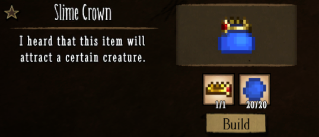

# Terraria King Slime 

This is a Don't Starve Together mod that adds in King Slime from Terraria.
LEGAL NOTICE: For obvious and legal reasons, I do not own the assets in this mod, and they belong to their respective owner (Re-Logic and Klei Entertainment).

Note that for modders looking through the source code, some of the stuff that I did in here isn't the official way of doing due to me not able to get it to work, so I did them in a janky way.

# Installation
you can download the mod from the [Steam's Workshop page](https://www.youtube.com/watch?v=dQw4w9WgXcQ) or from the [release tab](https://www.youtube.com/watch?v=dQw4w9WgXcQ).  

# What does the Mod adds?
The mod adds in 5 new items, with 2 of them being craftable, and 2 new enemies, and a 1 new boss.
## Items
### Gel:&nbsp;&nbsp;
Gel is a item that is dropped from slime. They are used for crafting the slime crown, and to spawn in King Slime.

### Crown:&nbsp;&nbsp;
Crown is a craftable item. It is use to make the slime crown.
 
 

### Slime Crown:&nbsp;&nbsp;
Slime Crown is a craftable item. It is use to spawn in King Slime by left clicking gel on it.
 
 

### Royal Gel:&nbsp;&nbsp;
Royal Gel is a item that is dropped from King Slime. While this item is in your inventory, slimes will not attack you.

### Slimy Jerky:&nbsp;&nbsp;
Slimy Jerky is meat that is dropped from King Slime. Eating this meat will give you 75 hunger, -3 health, and -10 sanity. It will also rot in 6 days.
 
 

## Enemies
### Slimes:   

 
Slime is an enemy that spawn in when the Terrarium is place down on the floor during day time. They can randomly spawn in as blue, green, or purple. They will either sit still, or wander around the world, until they see a player. When the slime see a player, it will chase them down until it no longer sees the player. Once it's get close enough to the player, it will jump up in place to attack the player. Killing the slime will cause it to drop 2 to 4 gels.
 
The slime has 130 HP, and does 20 damage.

### King Slime: &nbsp;&nbsp;

 
King Slime is an boss that spawns in when the player left click a slime crown with gel. King slime will target the nearest player, and chase the player down. When it get close enough, it will do a jump attack on the player. King Slime will also periodically spawn in weak slime during the fight. Killing King Slime will cause it to drop a Royal Gel, 5 to 14 Gel, and 1 to 4 Slimy Jerky.
 
King Slime has 2500 HP, does 105 damage, and drains 100 sanity per minute.

## Enemies
### Weak Slimes:   

 
Weak Slime is an enemy that spawn in during the King Slime fight. The A.I. for the weak slime is similar to normal slimes, but they will always chase down the closest player. It also looks like the normal slimes, but it has very low HP, and drops nothing upon death.
 
The slime has 1 HP, and does 20 damage.
